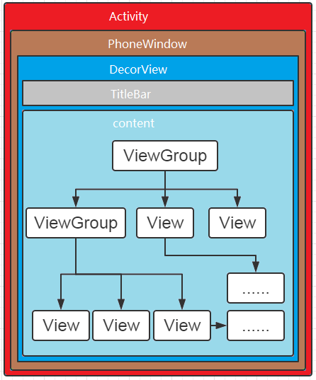

# Android View 系统

* 涉及到的组件
* 绘制 View 流程
* 自定义View

## 概述

Android View 系统的层级结构：

View 的绘制流程，需要了解的应该是每一帧的开始结束。所以只需要从 ViewRootImpl.performTraversals 开始，关注 measure, layout, draw 这三个关键过程。其中 measure, layout, draw 都是 final 方法，能够继承的是 onMeasure, onLayout, onDraw。

值得注意的是每次发起绘图时，并不会重新绘制每个View树的视图，而只会重新绘制那些“需要重绘”的视图，View类内部变量包含了一个标志位DRAWN，当该视图需要重绘时，就会为该View添加该标志位。

另外，可以编写 attr.xml 设置 xml 可用的属性。

#### MeasureSpec

MeasureSpec 包含了 mode 和 size 两个数据，可以通过 getMode 和 getSize 分别得到。MeasureSpec 是一个32位 int，其中高2位是 mode，后30位是 size，用二进制表示。

三种类型：

* EXACTLY 父容器精确指定了 View 的大小，包括 match_parent 和设置具体大小两种情况。 -1
* AT_MOST 父容器指定了最大的大小，不能超过，对应 wrap_content。 -2
* UNSPECIFIED 未限制大小，一般用于系统内部，表示正在测量状态。 0

View 的 MeasureSpec 是由父布局 MeasureSpec 和自身的 LayoutParams 共同决定。可以从 View 追溯到 DecorView，而 DecorView 的 MeasureSpec 是来自于 ViewRootImpl.getRootMeasureSpec。

**具体计算规则**

| childLayoutParams \ parentSpecMode | EXACTLY              | AT_MOST              | UNSPECIFIED         |
| ---------------------------------- | -------------------- | -------------------- | ------------------- |
| dp/px                              | EXACTLY + childSize  | EXACTLY + childSize  | EXACTLY + childSzie |
| match_parent                       | EXACTLY + parentSize | AT_MOST + parentSize | UNSPECIFIED + 0     |
| wrap_content                       | AT_MOST + parentSize | AT_MOST + parentSize | UNSPECIFIED + 0     |

在计算出 child MeasureSpec 之后，开始调用 child.measure 进行测量。自定义 View 时，可通过覆盖 onMeasure 来得到自身的大小，然后再进行 child 的 measure。递归直到遍历完整个 View tree。

#### Layout

在 measure 确定了 View 的大小后，会调用 layout 方法来确定 child 的具体位置。ViewGroup 中，onLayout 是抽象方法，在自定义时，需要覆盖此方法从而达到自定义 child 的布局。

通过在 onLayout 中调用 child.layout(l, t, r, b)  来设置 child 的具体位置。一般来说会根据 measure 所取得的大小，再加上 padding， margin， gravity 等信息，综合决定 child.layout( ) 中的数值。但是这些也不是必须的，child.layout 中可以任意设置，也就是说 measure 过程不是必须的。

#### Draw

Draw 的过程是将 View 绘制到屏幕上，顺序如下：

* 绘制背景
* 绘制自己
* 绘制 children
* 绘制装饰

其中，setWillNotDraw 会导致 View 不被绘制，默认 ViewGroup 是不绘制的。

**drawBackground** 通过调用此方法绘制背景。

**onDraw** 调用此方法绘制自身，也就是自定义 View 中最常见的方法。

**dispatchDraw** 调用各个 child 绘制自己。一般来说不需要覆盖，但是如果有特殊需求，比如说限制 child 绘制的范围等，也可以通过覆盖此方法自定义逻辑。

**onDrawScollBars** 绘制滚动条。

注意：FrameLayout 这种 foreground 的绘制，是通过覆盖 draw 方法，由于 draw 中会依次调用：drawBackground, onDraw, dispatchDraw 等。所以到此都是和其他 View 一样。而 FrameLayout 通过覆盖 draw，在 super.draw() 之后，还进行了 foreground 的绘制。从而达到了最上层绘制的目的。

### 优化自定义 View

**onDraw 开始尽量不进行内存分配** 先从onDraw开始，需要特别注意不应该在这里做内存分配的事情，因为它会导致GC，从而导致卡顿。在初始化或者动画间隙期间做分配内存的动作。不要在动画正在执行的时候做内存分配的事情。

**减少调用 invalidate 次数，尤其是无参，会导致 View tree 全部重绘** 你还需要尽可能的减少onDraw被调用的次数，大多数时候导致onDraw都是因为调用了invalidate().因此请尽量减少调用invaildate()的次数。如果可能的话，尽量调用含有4个参数的invalidate()方法而不是没有参数的invalidate()。没有参数的invalidate会强制重绘整个view。

**减少 View 层级** 另外一个非常耗时的操作是请求layout。任何时候执行requestLayout()，会使得Android UI系统去遍历整个View的层级来计算出每一个view的大小。如果找到有冲突的值，它会需要重新计算好几次。另外需要尽量保持View的层级是扁平化的，这样对提高效率很有帮助。

**复杂 UI 直接自定义 ViewGroup，调用 layout 来直接布局，而无需 measure。** 如果你有一个复杂的UI，你应该考虑写一个自定义的ViewGroup来执行他的layout操作。与内置的view不同，自定义的view可以使得程序仅仅测量这一部分，这避免了遍历整个view的层级结构来计算大小。这个PieChart 例子展示了如何继承ViewGroup作为自定义view的一部分。PieChart 有子views，但是它从来不测量它们。而是根据他自身的layout法则，直接设置它们的大小。

### 其他小问题

**invalidate 和 postInvalidate 区别**

前者在主线程中，后者在子线程，都是重绘 UI。
